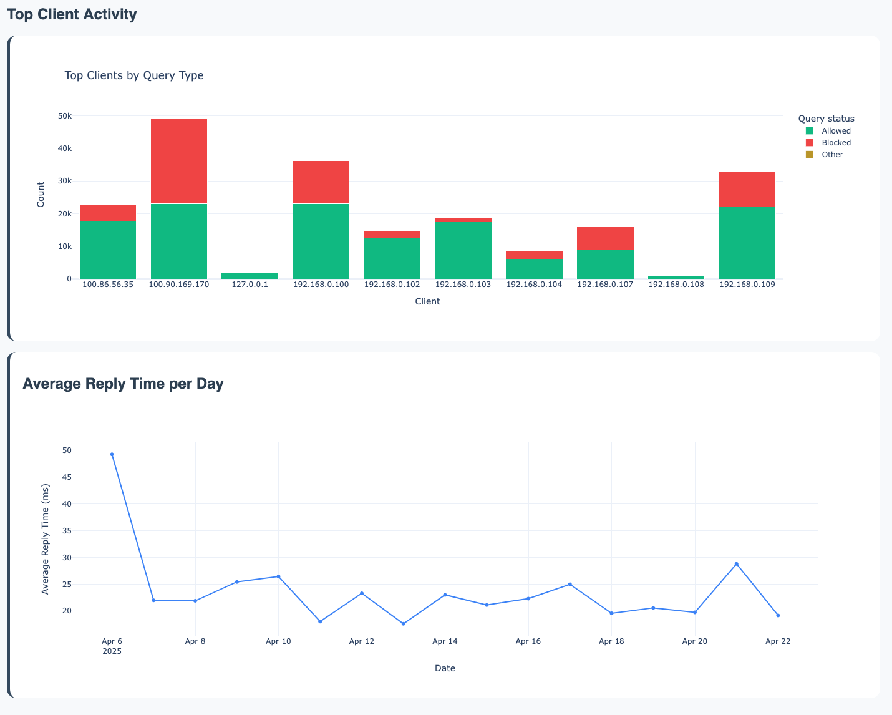

# Pi Hole Long Term Statistics v.0.1.1

A dashboard built with **Dash** and **Plotly** to explore long-term DNS query data from a **Pi-hole v.6** FTL database file. Visualize allowed vs blocked domains, top clients, and query trends over time. If you find this project helpful, please consider giving it a ⭐ to show your support.


**Disclaimer : This is an unofficial, third-party project. The Pi Hole team and the development of Pi Hole software is not related to this project.**

<center>


<details>
<summary>More screenshots</summary>

</details>
</center>

## 🧰 Features
- 🗂️ Info cards : Query stats, Activity stats, Day and Night stats. See [all supported metrics](#supported-metrics)
- 📈 Interactive charts for query trends and client behavior  
- 🔍 Filter queries by client  
- 🌐 View top blocked/allowed domains  
- 📅 Analyze queries and compute stats over a custom date range.

## 📦 Dependencies

- Python 3.10 and above
- Pi-hole (> v.6) FTL database file (pihole-FTL.db)

## 🚀 Getting Started

There are multiple ways to run the dashboard: using Python or Docker.

> [!WARNING]
> Using your actual Pi-hole FTL db file for querying is **not** recommended. Place the copy in the project root or specify its path using the `--db_path` argument or `PIHOLE_LT_STATS_DB_PATH` environment variable. You can set up a cron job to periodically copy the FTL database to this location, ensuring your stats are updated without touching the live database. In any case, PiHoleLongTermStats does not monitor for changes in the Pi-hole FTL db file even if you mount it. PiHoleLongTermStats re-reads the Pi-hole FTL db file at the provided path and re-computes all the stats every time the page is reloaded or the reload button is clicked in the dashboard. 


### Using Python

1. Clone this repository and move into the project folder:

    ```bash
    git clone https://github.com/davistdaniel/PiHoleLongTermStats.git
    cd PiHoleLongTermStats
    ```

2. Install dependencies using pip:

    ```bash
    pip install -r requirements.txt
    ```

3. Make a copy/backup of your `pihole-FTL.db` (**Important!**) and place it in the PiHoleLongTermStats directory:
    ```bash
    # Example: Copy from the default Pi-hole location
    sudo cp /etc/pihole/pihole-FTL.db . 
    # Ensure the user running the app has read permissions
    sudo chown $USER:$USER pihole-FTL.db 
    ```

4. Run the app:

    ```bash
    python app.py [OPTIONS]
    ```
    See the Configuration section below for available options.

5. Open your browser and visit [http://localhost:9292](http://localhost:9292)

### 🐳 Using Docker

If you have a copy of your `pihole-FTL.db` file, you can quickly run the dashboard using Docker Compose.

1. Make a directory for PiHoleLongtermStats:
    ```bash
    mkdir PiHoleLongTermStats
    cd PiHoleLongTermStats
    ```

2. Make a copy/backup of your `pihole-FTL.db` (**Important!**) and place it in the PiHoleLongTermStats directory:

   ```bash
   # Example: Copy from the default Pi-hole location
   sudo cp /etc/pihole/pihole-FTL.db . 
   # Ensure the user running the app has read permissions (Docker needs this)
   sudo chown $USER:$USER pihole-FTL.db
   ```
3. Make a docker-compose.yml file in the same directory:

    ```docker
    services:
      pihole-long-term-stats:
        image: ghcr.io/davistdaniel/piholelongtermstats:latest
        container_name: pihole-lt-stats
        ports:
          - "9292:9292"  # Map host port 9292 to container port 9292
        volumes:
          - ./pihole-FTL.db:/app/pihole-FTL.db:ro  # Path to your Pi-hole DB file (adjust if it's not in current directory)
        environment:
          - PIHOLE_LT_STATS_DB_PATH=/app/pihole-FTL.db  # Path inside the container to the mounted DB file
          - PIHOLE_LT_STATS_DAYS=31                    # Number of days of data to analyze; change if desired
          - PIHOLE_LT_STATS_PORT=9292                   # Port the app listens to inside container; keep in sync with ports mapping
        restart: unless-stopped
    ```
    and run using :

    ```bash
    sudo docker compose up -d
    ```

4. Open your browser and visit [http://localhost:9292](http://localhost:9292)


## ⚙️ Configuration

You can configure the application using command-line arguments or environment variables:

| Command-Line Argument | Environment Variable         | Default Value   | Description                                      |
|-----------------------|------------------------------|-----------------|--------------------------------------------------|
| `--db_path PATH`      | `PIHOLE_LT_STATS_DB_PATH`    | `pihole-FTL.db` | Path to the copied Pi-hole database file.        |
| `--days DAYS`         | `PIHOLE_LT_STATS_DAYS`       | `31`           | Number of days of past data to analyze.          |
| `--port PORT`         | `PIHOLE_LT_STATS_PORT`       | `9292`          | Port number to serve the Dash app on.            |

## Supported metrics
| Metric | Description |
|--------|-------------|
| Allowed Queries | Total number of queries that were allowed through the Pi-hole. |
| Blocked Queries | Total number of queries that were blocked by the Pi-hole. |
| Top Allowed Domain | The domain which was allowed the most |
| Top Blocked Domain | The domain which was blocked the most |
| Total Unique Clients | The total number of unique devices that made queries. |
| Total Queries | Total number of queries processed by the Pi-hole. |
| Highest number of queries were on | The date with the peak query count. |
| Lowest number of queries were on | The date with the lowest query count. |
| Average reply time | The average time it takes for the Pi-hole to respond to a query. |
| Most Active Hour | The hour with the highest number of queries. |
| Least Active Hour | The hour with the lowest number of queries. |
| Most Active Day of the Week | The day with the highest query activity. |
| Least Active Day of the Week | The day with the lowest query activity. |
| Longest Blocking Streak | The longest consecutive period where queries were blocked. |
| Longest Allowing Streak | The longest consecutive period where queries were allowed. |
| Total queries during the day | Total number of queries made during daytime hours (06:00 to 23:59). |
| Total queries during the night | Total number of queries made during nighttime hours. |
| Top allowed domain during the day | The most allowed domain during the day. |
| Top blocked domain during the day | The most blocked domain during the day. |
| Top allowed domain during the night | The most allowed domain during the night. |
| Top blocked domain during the night | The most blocked domain during the night. |
| Most Persistent Client | The client that made the highest number of queries. |
| Most Diverse Client | The client that queried a blocked domain the most times. |
| Longest Idle Period | The longest period without any queries. |
| Slowest Responding Domain | The domain with the highest average response time. |
| Average Time Between Blocked Queries | Average interval between consecutive blocked queries. |
| Average Time Between Allowed Queries | Average interval between consecutive allowed queries. |


## 🧑‍💻 Contributing

Any contribution, feature ideas or bug fixes are always welcome.

## 📄 License
[MIT](LICENSE)


