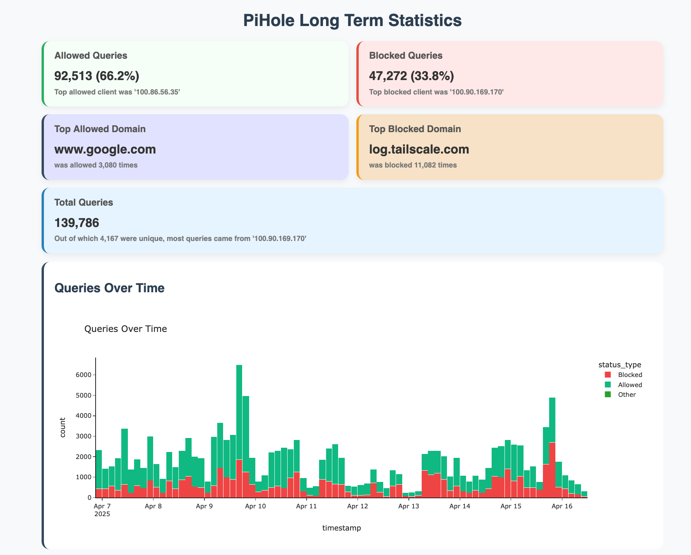

# Pi Hole Long Term Statistics

A dashboard built with **Dash** and **Plotly** to explore long-term DNS query data from a **Pi-hole v.6** FTL database file. Visualize allowed vs blocked domains, top clients, and query trends over time.

<p align="center">

</p>

## 🧰 Features

- 📈 Interactive charts for query trends and client behavior  
- 🔍 Filter queries by client  
- 🌐 View top blocked/allowed domains  
- 📅 Analyze queries over a custom number of past days  

## 📦 Dependencies

- Python 3
- Pi-hole (> v.6) FTL database file (pihole-FTL.db)
- Python packages:  
  - `dash`  
  - `plotly`  
  - `pandas`

    
    ```bash
    python -m pip install dash plotly pandas
    ```

## 🚀 Getting Started
- Clone this repository and move into the project folder:

    ```bash
    git clone https://github.com/davistdaniel/PiHoleLongTermStats.git
    cd PiHoleLongTermStats
    ```

- Make sure you have all dependencies (see above) needed by the dashboard to work.
- Make a copy/backup of your pihole-FTL.db (**Important!**). Don't use your actual Pi-hole FTL db file for querying.

    ```bash
    sudo cp /etc/pihole/pihole-FTL.db $HOME/PiHoleLongTermStats/``
    ```

- Change the ownership of the copied/backup database file to your user account:

    ```bash
    sudo chown $USER:$USER $HOME/PiHoleLongTermStats/pihole-FTL.db``
    ```
- Run app.py. 

    ```bash
    python app.py
    ```
    You can also provide optional flags to customize behavior:

        --db_path → Path to the copied Pi-hole database file

        --days → Number of days of past data to analyze (default: 365)

        --port → Port number to serve the Dash app on (default: 9292)

## 🧑‍💻 Contributing

Feel free to fork and contribute! Feature ideas or bug fixes are always welcome.

## 📄 License
[MIT](LICENSE)