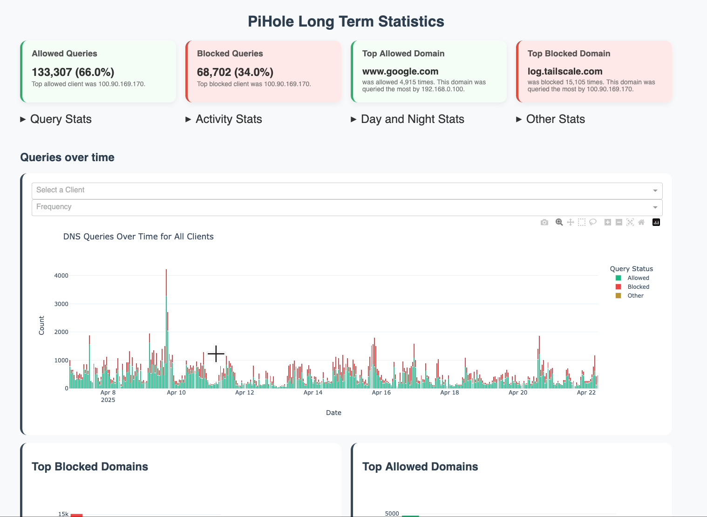

# Pi Hole Long Term Statistics

A dashboard built with **Dash** and **Plotly** to explore long-term DNS query data from a **Pi-hole v.6** FTL database file. Visualize allowed vs blocked domains, top clients, and query trends over time. If you find this project helpful, please consider giving it a ⭐ to show your support.

<center>


<details>
<summary>More screenshots</summary>

</details>
</center>

## 🧰 Features
- 🗂️ Info cards : Query stats, Activity stats, Day and Night stats
- 📈 Interactive charts for query trends and client behavior  
- 🔍 Filter queries by client  
- 🌐 View top blocked/allowed domains  
- 📅 Analyze queries over a custom number of past days  

## 📦 Dependencies

- Python 3
- Pi-hole (> v.6) FTL database file (pihole-FTL.db)

## 🚀 Getting Started

There are multiple ways to run the dashboard: using Python, Docker, or Docker Compose.

### Using Python

1. Clone this repository and move into the project folder:

    ```bash
    git clone https://github.com/davistdaniel/PiHoleLongTermStats.git
    cd PiHoleLongTermStats
    ```

2. Install dependencies using pip:

    ```bash
    pip install -r requirements.txt
    ```

3. Make a copy/backup of your `pihole-FTL.db`
    ```bash
    # Example: Copy from the default Pi-hole location
    sudo cp /etc/pihole/pihole-FTL.db . 
    # Ensure the user running the app has read permissions
    sudo chown $USER:$USER pihole-FTL.db 
    ```

> [!WARNING]
> Don't use your actual Pi-hole FTL db file for querying. Place the copy in the project root or specify its path using the `--db_path` argument or `PIHOLE_LT_STATS_DB_PATH` environment variable.

4. Run the app:

    ```bash
    python app.py [OPTIONS]
    ```
    See the Configuration section below for available options.

5. Open your browser and visit [http://localhost:9292](http://localhost:9292)

### 🐳 Using Docker Compose

If you have a copy of your `pihole-FTL.db` file, you can quickly run the dashboard using Docker Compose.

1. Clone this repository:

    ```bash
    git clone https://github.com/davistdaniel/PiHoleLongTermStats.git
    cd PiHoleLongTermStats
    ```

2. Make a copy/backup of your `pihole-FTL.db` (**Important!**) and place it in the project root directory.

   ```bash
   # Example: Copy from the default Pi-hole location
   sudo cp /etc/pihole/pihole-FTL.db . 
   # Ensure the user running the app has read permissions (Docker needs this)
   sudo chown $USER:$USER pihole-FTL.db
   ```

3. You can change the configurations in the docker-compose.yml file or start the dashboard with the default options:

   ```bash
   sudo docker compose up -d
   ```

4. Open your browser and visit [http://localhost:9292](http://localhost:9292)

### Using Docker

1. Clone this repository:

    ```bash
    git clone https://github.com/davistdaniel/PiHoleLongTermStats.git
    cd PiHoleLongTermStats
    ```

2. Make a copy/backup of your `pihole-FTL.db` (**Important!**) and place it in the project root directory.

    ```bash
    # Example: Copy from the default Pi-hole location
    sudo cp /etc/pihole/pihole-FTL.db . 
    # Ensure the user running the app has read permissions (Docker needs this)
    sudo chown $USER:$USER pihole-FTL.db
    ```

3. Build the Docker image:

    ```bash
    sudo docker build -t pihole-long-term-stats .
    ```

4. Run the Docker container, mounting the database file and mapping the port:

    ```bash
    sudo docker run -d --name pihole-LT-stats \
    --restart always \
    -p 9292:9292 \
    -v "$(pwd)/pihole-FTL.db:/app/pihole-FTL.db:ro" \
    pihole-long-term-stats
    ```

    Note: The database is mounted read-only (`:ro`). You can pass configuration options (see below). Ensure the internal path `/app/pihole-FTL.db` is used if setting `PIHOLE_LT_STATS_DB_PATH` or `--db_path` inside Docker.

5. Open your browser and visit [http://localhost:9292](http://localhost:9292)

6. To stop the container :

    ```bash
    sudo docker stop pihole-LT-stats
    sudo docker rm pihole-LT-stats
    ```


## ⚙️ Configuration

You can configure the application using command-line arguments or environment variables:

| Command-Line Argument | Environment Variable         | Default Value   | Description                                      |
|-----------------------|------------------------------|-----------------|--------------------------------------------------|
| `--db_path PATH`      | `PIHOLE_LT_STATS_DB_PATH`    | `pihole-FTL.db` | Path to the copied Pi-hole database file.        |
| `--days DAYS`         | `PIHOLE_LT_STATS_DAYS`       | `365`           | Number of days of past data to analyze.          |
| `--port PORT`         | `PIHOLE_LT_STATS_PORT`       | `9292`          | Port number to serve the Dash app on.            |


## 🔁 Optional: Auto-Restart Script
You can use the following helper script to periodically refresh your Pi-hole FTL database and restart the dashboard container automatically using Docker Compose. This ensures the dashboard stays up-to-date with the latest DNS query data.
### auto_pihole_LT_stats.sh
```bash
#!/bin/bash

APP_DIR="." # working directory with docker-compose.yml
LOG_FILE="$APP_DIR/pihole_LT-stats.log"
USER_NAME="yourusername" # replace with your actual system username

# Time range in seconds
MIN_SLEEP=$((1 * 24 * 3600))   # 1 day
MAX_SLEEP=$((7 * 24 * 3600))   # 7 days

while true; do
  echo "[$(date)] Starting Pi-hole LT statistics dashboard via Docker Compose" | tee -a "$LOG_FILE"

  # Copy DB
  if cp /etc/pihole/pihole-FTL.db "$APP_DIR/pihole-FTL.db"; then
    chown "$USER_NAME:$USER_NAME" "$APP_DIR/pihole-FTL.db"
    echo "[$(date)] Copied pihole-FTL.db and updated ownership" | tee -a "$LOG_FILE"
  else
    echo "[$(date)] ERROR: Failed to copy pihole-FTL.db. Using existing database. Skipping container restart." | tee -a "$LOG_FILE"
    continue
  fi

  # Stop and remove existing container
  echo "[$(date)] Stopping existing container..." | tee -a "$LOG_FILE"
  docker compose -f "$APP_DIR/docker-compose.yml" down >> "$LOG_FILE" 2>&1

  # Start the container
  echo "[$(date)] Starting container..." | tee -a "$LOG_FILE"
  docker compose -f "$APP_DIR/docker-compose.yml" up -d >> "$LOG_FILE" 2>&1

  echo "[$(date)] Container restarted via Docker Compose." | tee -a "$LOG_FILE"

  # Generate random sleep duration
  SLEEP_DURATION=$((RANDOM % (MAX_SLEEP - MIN_SLEEP + 1) + MIN_SLEEP))

  HOURS=$((SLEEP_DURATION / 3600))
  MINUTES=$(((SLEEP_DURATION % 3600) / 60))
  NEXT_UPDATE_TIME=$(date -d "+$SLEEP_DURATION seconds" +"%Y-%m-%d %H:%M:%S")

  echo "[$(date)] Sleeping for $HOURS hours and $MINUTES minutes. Next update at $NEXT_UPDATE_TIME." | tee -a "$LOG_FILE"

  sleep "$SLEEP_DURATION"
done
```
### Usage
Make the script executable and run it: 
```bash
chmod +x auto_pihole_LT_stats.sh
sudo ./auto_pihole_LT_stats.sh
```

## 🧑‍💻 Contributing

Feel free to fork and contribute! Feature ideas or bug fixes are always welcome.

## 📄 License
[MIT](LICENSE)

## 📄 Disclaimer
This is an unofficial, third-party project. The Pi Hole team and the development of Pi Hole software is not related to this project.
